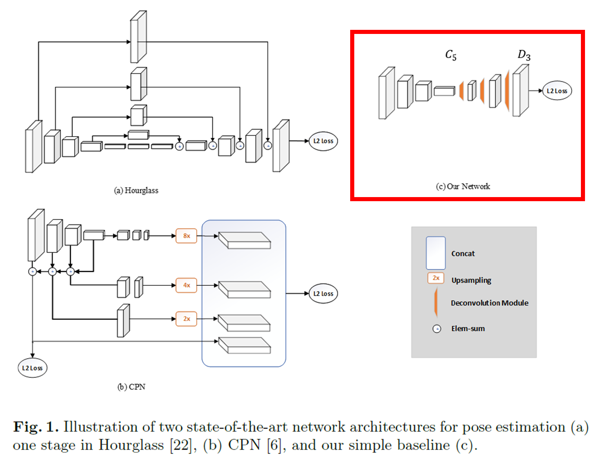
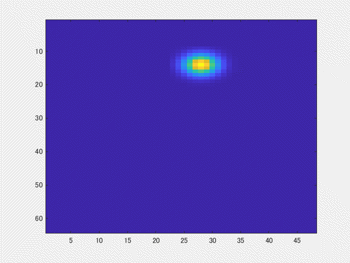
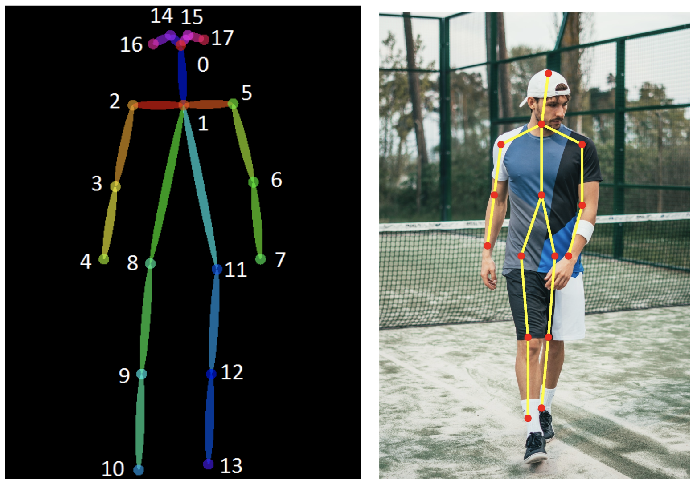
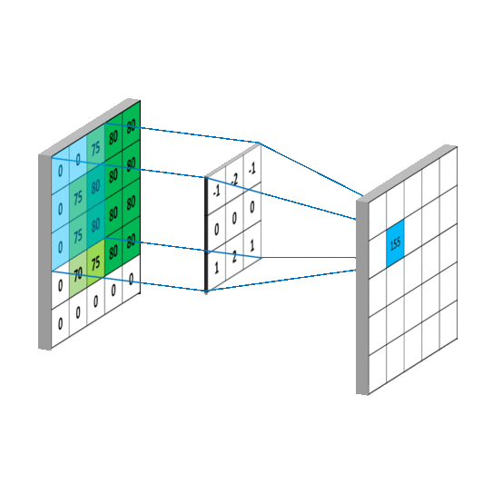
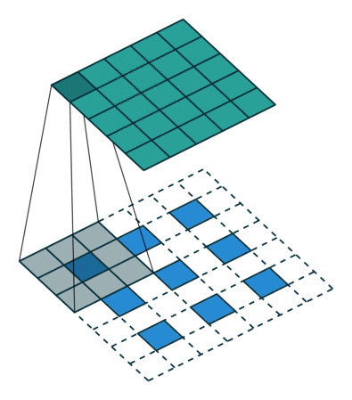
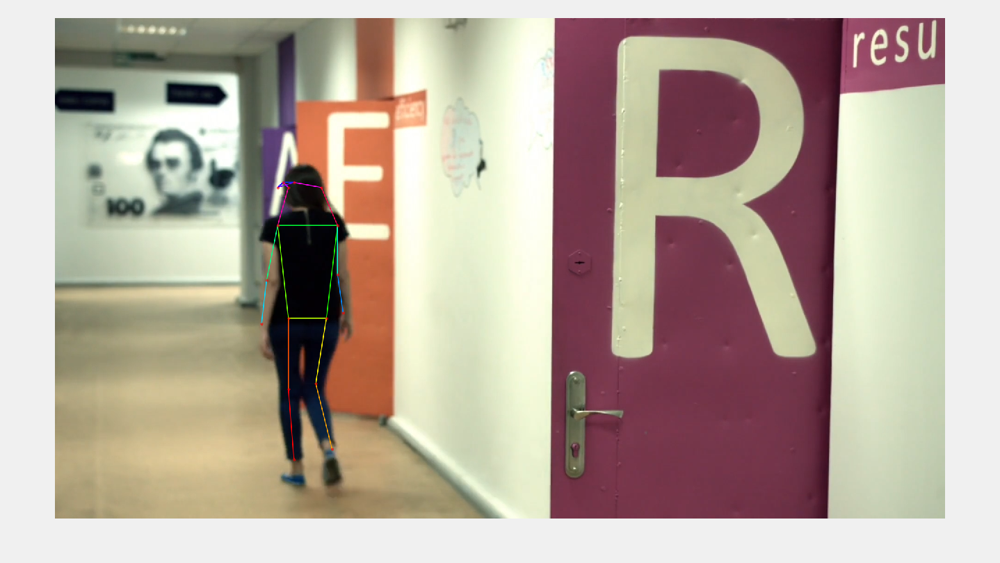
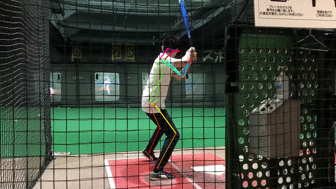

# シンプルかつ高精度な姿勢推定の手法について学んでみた（Xiao et al., ECCV, 2018）

このレポジトリは、[こちらのブログ](https://kentapt.hatenablog.com/entry/2021/12/11/231001?_ga=2.206475675.969068872.1638721409-1601353361.1630730568)のためのコードやデータを共有するためのものです。

この記事は、MATLAB/Simulink Advent Calendar 2021（カレンダー2）の12日目の記事として書かれています。

https://qiita.com/advent-calendar/2021/matlab

また、7日目や8日目（カレンダー1）でも記事を投稿していて、もしよろしければこちらもご覧いただけると幸いです。

[https://kentapt.hatenablog.com/entry/2021/12/06/014209?_ga=2.68137113.969068872.1638721409-1601353361.1630730568](https://kentapt.hatenablog.com/entry/2021/12/06/014209?_ga=2.68137113.969068872.1638721409-1601353361.1630730568)

[https://kentapt.hatenablog.com/entry/2021/12/06/224424](https://kentapt.hatenablog.com/entry/2021/12/06/224424)

この記事での取り組みは以下のような姿勢推定と呼ばれるものです。自動的に人間の腕や頭、足の情報を取得できていることがわかります。この手法について、私のほうで論文やコードを見ながら勉強したので、ここで、共有させていただきたいと思います。ここでは、姿勢推定のみを扱います。間違いや誤字などがあれば教えていただけますと幸いです。
  


動画出展：pixabay（フリー動画素材: [URL](https://pixabay.com/ja/videos/%E3%82%AA%E3%83%95%E3%82%A3%E3%82%B9-%E4%BA%BA%E3%80%85-%E4%BB%95%E4%BA%8B-%E3%83%81%E3%83%BC%E3%83%A0-39890/)）

このように、いい感じに、骨格の情報を画像から推定できていて、見ているだけでも楽しいだけでなく、実際に姿勢推定は産業系（製造・建設など）やスポーツ、研究・教育用途、エンターテインメント、医療・リハビリなど多くの業界で役立つようです。

https://www.next-system.com/blog/2021/02/12/post-3763/

なお、ここで紹介する実装は、私自身でなく、[こちらのTohruKさんのもの](https://github.com/matlab-deep-learning/Human-Pose-Estimation-with-Deep-Learning)です。非常にわかりやすいコードで大変勉強になりました。ありがとうございました。

# 紹介する手法について

この記事では、Xiaoら（2018）の Simple Baselines for Human Pose Estimation and Trackingという論文で提案されている手法について取り上げます。この手法の特徴としては、

   -  シンプルな手法である 
   -  高精度である 
   -  他の手法と比べる際のベースライン（基準）になりえる 
   -  よりアップデートされたモデルを考える手助けになる 
   -  これらのタスクの評価が簡単になる 

といった感じだと思います。この手法だけでなく、多くの手法が提案されていて、この手法の特徴や立ち位置については、実際にもととなる論文のイントロダクションを読むのが良いと思います。以下に、**私の勝手な解釈に基づいた**論文のイントロダクションの和訳を掲載します。意訳なども含むのでご注意ください。

# もととなる論文のイントロダクションの和訳
  

========================================================

多く存在するコンピュータービジョンでの課題と同様に、人間の姿勢推定は、深層学習の利用によって大きく進歩した。参考文献[31, 30]で報告されたような、先駆的な研究がされて以来，MPIIベンチマーク[3]での性能は3年で向上し、現在は飽和状態になっている。約80%から始まり、現在は、90%以上[22, 8, 7, 33]となっている。しかし最近公開された、より難易度の高いベンチマークであるCOCO human pose benchmark [20]では、さらなる発展が日々繰り返されている。mAP (mean Average Precision)という指標にておいては、60.5（COCO 2016 Challenge winner [9, 5]）から1年で72.1（COCO 2017 Challenge winner [6, 9]）まで向上した。このように姿勢推定の急速な発展に伴い、「in the wildな姿勢検出と追跡の同時実行」という、より困難な課題が発生した。（筆者追記：in the wildとは、[本稿参考文献[2]](https://link.springer.com/chapter/10.1007/978-3-642-15549-9_43)では、in real images taken in unconstrained environmentsと言い換えられていて、より自然で制約のない状況で撮られた画像、といった解釈でよいと思います。その逆の撮影方法として、例えば、「この光源でこの条件で撮るぞ」といったような制約があって、取得される画像の幅が限定的であるものを言うのではないかと理解しています）そこでは、“simultaneous pose detection and tracking in the wild”という、より挑戦的な課題が最近発表された[2]。

　テストをするデータセットがより複雑になっているだけでなく、それと同時に，深層学習モデルのネットワーク構造や実験のやり方もどんどん複雑化している。そのため，アルゴリズムの分析と比較がより困難になっている。例えば，MPIIベンチマーク[3]における主要な手法[22, 8, 7, 33]は，その方法において、非常に大きな違いがある一方、精度面は差はわずかである。これらを比較・検討するにあたって、どの部分が重要なのかを判断するのは困難である。また、COCOベンチマークの代表的な手法[21, 24, 12, 6, 5]も複雑であるうえ、それらにも大きな違いが存在する。これらの手法の比較は、ほとんどがそのシステム全体での比較にとどまり、あまり参考にはなりにくい。一方、姿勢のトラッキングについては、これまではあまり研究されてこなかったが[2]、その課題設定がより複雑になり、解決方法もより複雑になることで、解決策も多様になり、それを解くモデルの複雑さもさらに増すことが予想される。

　本研究では、別の視点から疑問を投げかけ、検討することで、これらの問題を解決することを図る。その問いとは、「シンプルな手法では、どれくらい姿勢推定や姿勢のトラッキングの問題を解くことができるのであろうか？」ということで、ここでは、姿勢推定やトラッキングのためのシンプルな深層学習のモデルを提案する。これらのモデルは非常にシンプルでありつつ、精度の高いものとなっている。そのため、そのシンプルなモデルを起点に新しいより高精度なモデルの開発に向けたアイデアを導いたり、その課題に対する評価を単純化するのに役立つことが期待される。（筆者追記：私の勝手な理解では、シンプルかつ高精度なモデルがあると、そこからプラスアルファとして何ができるか？ということを考えて実行できる。そして、それをいい意味での「踏み台」として使うことで、その姿勢推定などの課題に対する、より高い精度が出しやすくなるのでいいよね、という意味だと思っています）本論文で提案されたモデルのコードと、学習されたモデルは、研究者コミュニティのために公開される予定である。

　我々の姿勢推定モデルは、バックボーン・ネットワークであるResNet[13]に、いくつかの逆畳み込み層（転置畳み込み層）を付加することで構成されている。これは、深い層を持ち、かつ低解像度な特徴マップからヒートマップを推定するタイプでは、おそらく最も単純な方法でありながら、COCOテストにおいて、mAP 73.7という最も高い精度を記録した。これは、前回の最良のモデルの持つ精度に比べ、1.6%の精度向上であった（筆者追記：ここでは、アンサンブルモデル（同様のモデルを複数利用することで精度向上をさせる技術）に対する記述もありましたが、和訳には反映させていません）。

　我々の姿勢追跡に関しては，ICCV'17 PoseTrack Challenge [2]の優勝者[11]と同様のパイプラインを採用している。一方、姿勢推定には、先述したような独自の手法を用いている。姿勢追跡は、[11]と同様に”グレディ・マッチング手法”を使用している。唯一の改良点は、オプティカルフローに基づいた姿勢のフレーム間の連続性と類似性を利用したことである。本稿での最良の結果では、mAPスコア74.6、MOTAスコア57.8を達成し、これは，ICCV'17 PoseTringの優勝者である59.6と51.8に対し、それぞれ15%と6%の改善であり、最高レベルの精度を有する。

　本手法、理論的な根拠に基づくものではなく、シンプルな技術に基づいている。アブレーション実験（１つの入力を省いて出力結果を得ることを繰り返し、どの入力が重要であるかを検討すること）をくまなく行い、有用性を検証してはいるものの、先行手法に対するアルゴリズムそのものの優位性を主張するものではないことに注意していただきたい。結果（精度）自体は良いものの、従来の手法と公平条件で比較を行っているわけではなく、アルゴリズムの優位性は主張するものではない。先述したように、本研究の貢献は、この分野におけるベースラインを提案することである。

========================================================

このように、高い精度を目指すのではなく、シンプルかつ高精度なモデルを提案して、今後の研究に対する比較対象にしたり、改良を目指すときのたたき台になるのではないか、という方向性で発表されています。

  
# ネットワークの内容
## 概要について

下の図１の赤枠で囲まれたものが、この本稿で紹介するネットワークの構成です。別の高精度なモデル (a) (b)に比べ、シンプルな構造であることがわかると思います。



図１：モデルの構成について

図出展：[Xiao et al. (2018) [1] ](https://openaccess.thecvf.com/content_ECCV_2018/html/Bin_Xiao_Simple_Baselines_for_ECCV_2018_paper.html)

  

**入力：**（ひとりの）人の画像

**出力：**ヒートマップ　　　になっています。



図２：ヒートマップのイメージ

  
## ヒートマップとは？

出力がヒートマップになっているとはどういうことなのでしょうか。下の図３を見てください。こちらは、今回のネットワークの訓練データのイメージです。各骨格のキーポイントに17までの数字が割り振られています。上の図２の動画は、17までのキーポイントの位置のイメージで、各キーポイントの中心（図３の左の図の大きめの点）をじんわりと周りに広げた（にじませた）ものです。論文では、ガウシアンフィルタを用いてこのじんわりとしたヒートマップを作る（平滑化させる）とありました。このネットワークでのこのヒートマップを出力することを目指します。つまり、（縦）×（横）×（推定する骨格（肘や膝、頭など）の個数）のサイズを持つ値を出力します。ここでは、骨格の個数を17とすると、（縦）×（横）×17になります。それぞれのチャンネル（17個の奥行方向の出力）がそれぞれのポイント（例：鼻、肘、膝）を担当していて、そのポイントがありそうなところをヒートマップで表します。つまり、画像の中心に右ひじがありそうであれば、右ひじ担当のヒートマップは真ん中が高い値でそれ以外が低い値のヒートマップになるべきです。



図３：正解データのヒートマップについて

画像出典：[A 2019 guide to Human Pose Estimation with Deep Learning](https://nanonets.com/blog/human-pose-estimation-2d-guide/)

  
## 学習について

学習では、入力画像に畳み込み込み演算などをし、XY方向に解像度の低い特徴マップを得たのちに、さらに逆畳み込み（転置畳み込み）によって、アップサンプリングしていきます。出力は上で述べたヒートマップをターゲットとする骨格の数（例：17）だけ生成します。そして、ネットワークの生成したヒートマップ×17個分と、正解データのヒートマップの差分（ここでは平均二乗誤差）が少なくなるようにどんどんネットワークの重みやバイアスを更新していきます。

## アップサンプリングについて

畳み込みをすれば以下の動画のように、画像（入力）のサイズが小さくなることはイメージがつきやすい一方で、アップサンプリングはどうすればいよいのでしょうか。



動画出展：[Machine Learning Notebook](https://mlnotebook.github.io/img/CNN/convSobel.gif)

  

アップサンプリングでは、strideとよばれるパラメータに応じて、空白を作ります。以下の動画では、下の水色が入力で、緑が畳み込みをした後の結果のイメージです。ここではstrideを1にして、間に1つグリッドを入れてサイズを大きくしています。そしてそれを畳み込みをすることで出力のサイズが大きくなっていることがわかります。詳しくは以下のサイトなどにわかりやすく解説されていました。



動画出展：[Convolution arithmetic](https://github.com/vdumoulin/conv_arithmetic)

[https://nisshingeppo.com/ai/whats-deconvolution/](https://nisshingeppo.com/ai/whats-deconvolution/)

[https://www.matlabexpo.com/content/dam/mathworks/mathworks-dot-com/images/events/matlabexpo/jp/2017/b1-image-processing-for-deep-learning.pdf](https://www.matlabexpo.com/content/dam/mathworks/mathworks-dot-com/images/events/matlabexpo/jp/2017/b1-image-processing-for-deep-learning.pdf)

# ネットワークを試してみる

訓練の際の詳細などはかけていませんが、ひとまず以上で本手法のおおまかな流れは切り上げて、実際の画像に対してテストしてみたいと思います。ここでは、[COCOデータセット](https://cocodataset.org/#home)を用いて訓練済みのネットワークをインポートしてテストしていきます。

再度の共有になりますが、ここで用いたコードは、こちらにあります。動画に対して実行しGIFに保存するようにTohruK様のオリジナルのリポジトリのものから変更しています。また、このテストに必要なファイルのみアップロードしています。

https://github.com/KentaItakura/Human-Pose-Estimation-with-Deep-Learning?organization=KentaItakura\&organization=KentaItakura

# Step1: 学習済みモデルのロード

```matlab:Code
clear;clc;close all
addpath('src') 
addpath('src/data') % scrフォルダを見えるように
detector = posenet.PoseEstimator; % 学習済みモデルのインポート
% テストにおけるパラメータ
interval=3; % 計算速度アップのため、フレームを間引いて実行
DelayTime=0.03; % 生成するGIFファイルの切り替わりの秒数
```

# step2: テストする動画の読み込み

Office_39890.mp4を読み込みます（動画出展：pixabay（フリー動画素材: [URL](https://pixabay.com/ja/videos/%E3%82%AA%E3%83%95%E3%82%A3%E3%82%B9-%E4%BA%BA%E3%80%85-%E4%BB%95%E4%BA%8B-%E3%83%81%E3%83%BC%E3%83%A0-39890/)））。

```matlab:Code
videoName='Office_39890.mp4';
vidObj = VideoReader(videoName); % ビデオ読み込みの準備
[~,mainName,~]=fileparts(videoName); % GIFへの保存の準備
filename=[mainName,'_output.gif']; % 動画名＋ _output.gifで保存
count=1; % フレームの間引き用のカウンター
```

# step3: フレームごとに繰り返し操作

```matlab:Code
figure('Visible',"on")
while hasFrame(vidObj)
    I=readFrame(vidObj); % 次のフレームを読み込み
    if mod(count,interval)==0 % 間引き
```

ACF検出器を用いて画像中の人の検出

```matlab:Code
    [bboxes,scores] = detectPeopleACF(I,'Threshold',-5); % battingCage.mp4の場合は、'Threshold',-5のとき良好な人の検出ができた
    if ~isempty(scores) % 人が検出されたときのみ実行
```

検出されたそれぞれの人の領域を切り出しおよびそのバウンディングボックス情報の抽出

```matlab:Code
        [croppedImages, croppedBBoxes] = detector.normalizeBBoxes(I, bboxes);
```

ヒートマップに変換

```matlab:Code
        heatmaps = detector.predict(croppedImages);
        Iheatmaps = detector.visualizeHeatmaps(heatmaps, croppedImages);
```

ヒートマップからキーポイントを生成

```matlab:Code
        keypoints = detector.heatmaps2Keypoints(heatmaps);
        Iheatmaps = detector.visualizeKeyPoints(Iheatmaps,keypoints);
```

キーポイントを可視化

```matlab:Code
        Iout_keyPoints = detector.visualizeKeyPointsMultiple(I,keypoints,croppedBBoxes);
        imshow(Iout_keyPoints);drawnow
        else % 人が検出されなかった場合はフレームをそのまま表示
            Iout_keyPoints=I;
            imshow(I)
    end
        % ＧＩＦの容量削減のためリサイズ
        Iout_keyPoints=imresize(Iout_keyPoints,0.35);
        [A,map] = rgb2ind(Iout_keyPoints,256);
        if count == interval
            imwrite(A,map,filename,'gif','LoopCount',Inf,'DelayTime',DelayTime)
        else
            imwrite(A,map,filename,'gif','WriteMode','append','DelayTime',DelayTime);
        end
    end
        count=count+1; 
end
```



# 他の例1

   -  スキーの動画です。この骨格の角度などで、スキーの上手さなどの評価につながるかもしれません 
   -  リフトから降りて滑りだすところもうまく検出できていて、その角度の変化なども定量化するとおもしろそうです 


動画出展：pixabay ([チェアリフト スキー スキー場 冬のスポーツ 自然](https://pixabay.com/ja/videos/%E3%83%81%E3%82%A7%E3%82%A2%E3%83%AA%E3%83%95%E3%83%88-%E3%82%B9%E3%82%AD%E3%83%BC-%E3%82%B9%E3%82%AD%E3%83%BC%E5%A0%B4-72440/)）

# 他の例2

   -  バッティングセンターで珍しく、うまく打てた時の動画です 
   -  ただ何となく、**身体が上に伸びあがっている気がします**。腰の位置が画像でいう上にずれていて、目線がブレてるんでしょうか？ただ私は、部活動をやっていたのにもかかわらず、そのあたりが、あまりよくわかりません。 
   -  腰の位置や他の骨格の位置を経時的に捉えて、上手な人と比較してみたいですね。 



  
# 感想

   -  シンプルな手法でしたが、**自前のデータにもうまく当てはめられ非常に良好な結果を得ることができました** 
   -  確かにこのシンプルな手法だと、第三者が改良を加えるのも比較的可能そうです。そのときにすでにこの手法では良い結果が得られているので、**「こうしたらいいのでは？」といった第三者のアレンジで、このモデルより精度が高まれば、他の手法と比べても自然と競争力のあるものになっているものと思います。**その観点でも、このモデルを出発点して改良したり、また大きく方針のちがうモデルを作った場合でもこのシンプルなモデルと性能を比べることで、姿勢推定の結果の良しあしがクリアになりそうです。 
   -  以上の内容は一部私の勘違いがあるかもしれませんが、私の理解した限りでは、非常に有効で勉強しがいのある内容でした。実際の訓練の方法などは紹介できませんでしたが、気になる方はこの手法を[MATLAB実装したもとのページ](https://github.com/matlab-deep-learning/Human-Pose-Estimation-with-Deep-Learning)などを見てもらえればと思います。 

# 参考文献

[1] もととなっている論文： [Xiao, B., Wu, H. and Wei, Y., 2018. Simple baselines for human pose estimation and tracking. In Proceedings of the European conference on computer vision (ECCV) (pp. 466-481).](https://openaccess.thecvf.com/content_ECCV_2018/html/Bin_Xiao_Simple_Baselines_for_ECCV_2018_paper.html)

[2] In the wildの和訳に際し参考にした：[Wang, K. and Belongie, S., 2010, September. Word spotting in the wild. In European conference on computer vision (pp. 591-604). Springer, Berlin, Heidelberg.](https://link.springer.com/chapter/10.1007/978-3-642-15549-9_43)

[3] 山下隆義「[イラストで学ぶ ディープラーニング 改訂第2版](https://www.amazon.co.jp/%E3%82%A4%E3%83%A9%E3%82%B9%E3%83%88%E3%81%A7%E5%AD%A6%E3%81%B6-%E3%83%87%E3%82%A3%E3%83%BC%E3%83%97%E3%83%A9%E3%83%BC%E3%83%8B%E3%83%B3%E3%82%B0-%E6%94%B9%E8%A8%82%E7%AC%AC2%E7%89%88-KS%E6%83%85%E5%A0%B1%E7%A7%91%E5%AD%A6%E5%B0%82%E9%96%80%E6%9B%B8-%E5%B1%B1%E4%B8%8B/dp/4065133319) 」（姿勢推定のセクションにて勉強しました。非常にわかりやすかったです。）
